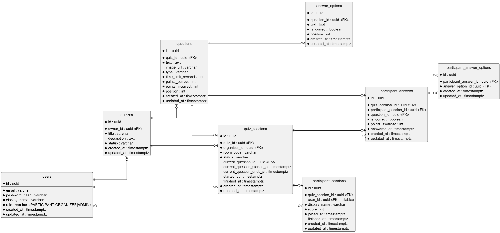

# ERD модели web-app-quiz

## Диаграмма

Исходник диаграммы находится в [`erd.puml`](./erd.puml).

## Краткое описание

Диаграмма описывает модель данных для MVP quiz-приложения.

Ключевая идея модели:

- `Quiz` — шаблон квиза, который создаёт организатор.
- `QuizSession` — конкретный live-запуск квиза.
- Один `Quiz` может быть запущен много раз через разные `QuizSession`.
- `Question` и `AnswerOption` описывают вопросы и варианты ответов.
- `ParticipantSession` хранит участие конкретного игрока в конкретной quiz-сессии.
- `ParticipantAnswer` и `ParticipantAnswerOption` хранят ответы участника.
- Баллы за правильный и неправильный ответ задаются на уровне `Question`.
- Фактически начисленные баллы сохраняются в `ParticipantAnswer.points_awarded`.
- Итоговый счёт участника хранится в `ParticipantSession.score` и не может быть отрицательным.
- Временные поля в модели представлены как `Instant`, а в PostgreSQL — как `TIMESTAMP WITH TIME ZONE`.

## Роли пользователей

Пользователь может иметь одну из трёх ролей:

- `PARTICIPANT` — участник, который проходит квизы.
- `ORGANIZER` — организатор, который создаёт и запускает квизы.
- `ADMIN` — администратор системы.

## Подключение участников

Участник подключается к live-сессии по `room_code`.

Если участник авторизован, `ParticipantSession.user_id` может ссылаться на `User`.

Если участник не авторизован, `ParticipantSession.user_id` остаётся пустым, а участник выбирает себе `display_name`.

`ParticipantSession.display_name` хранится отдельно от `User.display_name`, потому что имя игрока в конкретной сессии может отличаться от имени аккаунта.

В рамках одной quiz-сессии `display_name` должен быть уникальным.

## Основные правила

- Участник подключается к quiz-сессии по `room_code`.
- Ответы принимаются только во время активного вопроса.
- Активное окно ответа задаётся полями `QuizSession.currentQuestionStartedAt` и `QuizSession.currentQuestionEndsAt`.
- Backend сам проверяет корректность ответа.
- Backend сам рассчитывает `points_awarded`.
- Backend обновляет `ParticipantSession.score`.
- Frontend не должен передавать количество начисленных или снятых баллов.
- Для `SINGLE_CHOICE` участник выбирает ровно один вариант.
- Для `MULTIPLE_CHOICE` участник может выбрать несколько вариантов.
